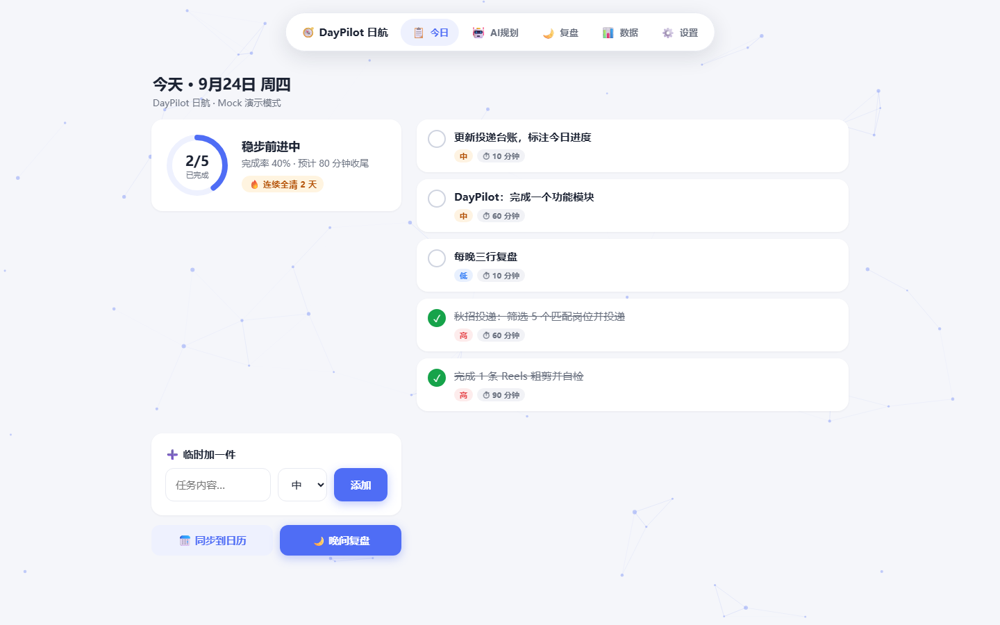
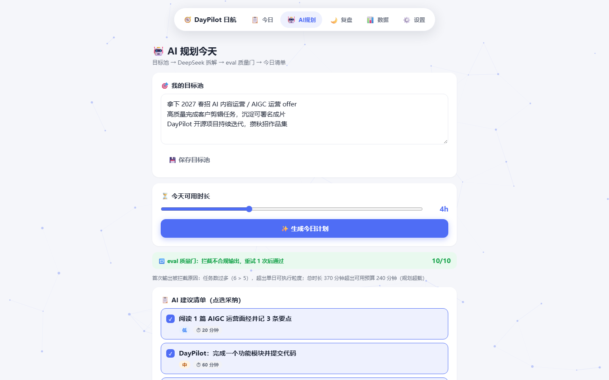
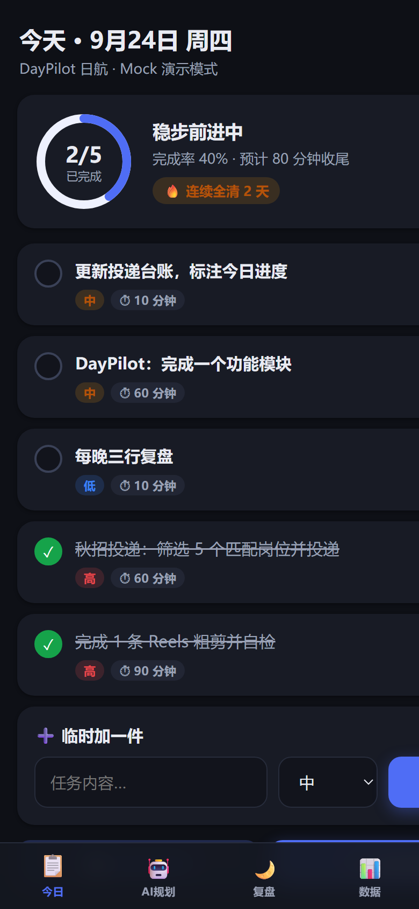
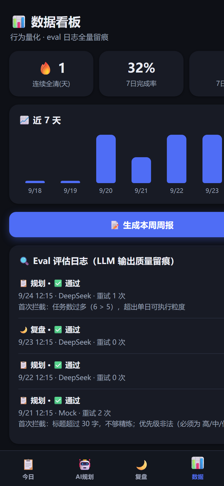

<div align="center">

# DayPilot 日航 🧭

**早规划 · 晚复盘 · 数据说话**

一个带 **LLM 输出质量评估流水线（Eval Pipeline）** 的 AI 个人效能 Agent
纯前端、零后端、零依赖，手机浏览器打开即用

[](https://jin2004-cmd.github.io/daypilot)
[](LICENSE)
[](#技术栈)
[](#参与贡献)

**[在线体验](https://jin2004-cmd.github.io/daypilot)** · **[使用说明](#快速开始)** · **[Eval 质量门](#核心亮点eval-质量门-)** · **[English](#english)**

</div>

---

## 这是什么

大多数「AI 待办 App」只是把大模型 API 套了个壳——模型输出什么就显示什么，错了也没人管。
DayPilot 的不同之处在于：**每一次 LLM 输出都要过一道质量门**，不达标就自动打回重试，全程留痕可审计。

**一天的使用闭环：**

```
🌅 早上  输入目标池 → AI 拆成今日 3-5 件事（带优先级/预估时长）→ 一键同步手机日历
☀️ 白天  极简勾选打卡（开屏 3 秒内完成操作）
🌙 晚上  AI 复盘教练：打分 + 拖延诊断 + 明日建议
📊 每周  数据看板 + 一键生成周报
```

## 截图

<div align="center">

| 桌面端 · 今日 | 桌面端 · AI 规划（eval 拦截重试） |
|---|---|
|  |  |

| 移动端 · 今日（深色） | 移动端 · 数据看板 + Eval 日志 |
|---|---|
|  |  |

</div>

## 核心亮点：Eval 质量门 🔍

所有 AI 输出（规划 / 复盘）都必须通过双层评估，这是本项目与其他「AI 套壳待办」的本质区别：

```
LLM 生成 ──► L1 规则校验（确定性）──► L2 质量打分（LLM-as-Judge）──► 通过 ✔
                │                         │
                └──► 不达标 ──► 自动重试（最多 2 次）──► 取历史最佳兜底
                                    │
                                    └──► 全程写入 Eval 日志（数据页可查）
```

| 层级 | 机制 | 校验内容 |
|---|---|---|
| L1 | 确定性规则校验 | JSON 结构、任务数 3-5、优先级枚举、单任务 5-240 分钟、总时长不超预算、无重复标题 |
| L2 | LLM-as-Judge 打分 | 可执行性、优先级结构、时长合理性、目标相关度（0-10 分，阈值 7） |

- **不达标 → 自动重试**（最多 2 次），取历史最佳结果兜底
- **全程留痕**：每次调用的校验结果、得分、重试次数写入 Eval 日志，App 内「数据」页可查看
- 无 API Key 时由启发式评分器兜底，eval 行为保持一致
- Mock 引擎内置「故意输出不合规」的演示路径：第一次生成必定被质量门拦截，可以直观看到拦截→重试→通过的全过程

## 功能

- 🤖 **AI 每日规划**：目标池 → 今日可执行清单（DeepSeek / 任意 OpenAI 兼容接口）
- ✅ **移动端极简打卡**：手势操作（右滑完成 / 左滑删除）、点按编辑、震动反馈
- 🎉 **游戏化激励**：全清 confetti 庆祝、连续全清 streak 呼吸动画
- 🌗 **深色模式**：跟随系统 / 手动切换，全组件适配
- ✨ **微交互打磨**：spring 弹性曲线、任务勾选 pop 动画、骨架屏 loading、数据看板数字滚动
- 🖥 **桌面端适配**：粒子星座背景（鼠标引力交互）、今日页双栏布局、顶部悬浮胶囊导航、悬停微交互
- 📅 **.ics 日历导出**：今日事项一键写入 iOS / 安卓系统日历，自带提前 10 分钟闹钟
- 🌙 **AI 晚间复盘**：完成度评分、优先级错配诊断、明日建议
- 📊 **数据看板**：连续全清天数、7 日完成率趋势、周报生成
- 💾 **本地优先**：localStorage 存储，数据 100% 在本机，支持 JSON 导出 / 导入
- 🔑 **自带 Key 即用**：设置页填入 DeepSeek API Key 自动切换真实接口；不填则走内置 Mock 引擎，全流程可体验

## 快速开始

### 在线体验（推荐）

👉 **<https://jin2004-cmd.github.io/daypilot>** —— 手机 / 电脑浏览器直接打开，Mock 模式免 Key 全流程可玩；想要真实 AI 效果，在「设置」里填入自己的 DeepSeek API Key 即可。

### 本地运行

无需构建，纯静态文件：

```bash
git clone https://github.com/jin2004-cmd/daypilot.git
cd daypilot
# 任意静态服务器，比如：
python -m http.server 8000
# 打开 http://localhost:8000
```

### 部署到 GitHub Pages

仓库 Settings → Pages → 选 main 分支根目录，即可获得公开访问链接。

## 技术栈

- **零构建纯前端**：原生 HTML / CSS / JavaScript（无框架、无依赖、无打包器）
- **LLM 接入**：OpenAI 兼容协议（默认 DeepSeek `deepseek-chat`，可换任意兼容服务）
- **数据层**：localStorage + JSON 导入导出（预留云同步接口）
- **日历联动**：RFC 5545 .ics 生成（含 VALARM 提醒）

## 项目结构

```
daypilot/
├── index.html        # 入口（单页应用）
├── manifest.json     # PWA 清单（可添加到主屏幕）
├── icon.svg          # 图标
├── css/style.css     # 移动端优先样式 + 深色模式 + 桌面端适配
├── js/
│   ├── templates.js  # 预置目标池与模板
│   ├── store.js      # localStorage 数据层 + 统计
│   ├── llm.js        # LLM 客户端（DeepSeek 真实接口 + Mock 引擎）
│   ├── eval.js       # ⭐ Eval 质量门（规则校验 + 打分 + 自动重试）
│   ├── ics.js        # .ics 日历导出
│   ├── particles.js  # 桌面端粒子背景
│   └── app.js        # 视图层（今日/规划/复盘/数据/设置）
└── docs/             # README 截图
```

## Roadmap

- [ ] 周视图的拖拽排程
- [ ] Web Push 定时提醒
- [ ] 可选云同步（Supabase / 自建 KV）
- [ ] eval 维度可配置化（自定义校验规则与阈值）

## 参与贡献

欢迎 Issue 和 PR：

1. Fork 本仓库
2. 新建分支：`git checkout -b feat/your-idea`
3. 提交改动：`git commit -m "feat: your idea"`
4. 推送并发起 Pull Request

特别是关于 **eval 校验维度** 的想法——什么样的 AI 规划算「好规划」，欢迎来聊。

## English

**DayPilot** is a zero-dependency, zero-backend AI personal-productivity agent for mobile browsers — with a built-in **LLM output evaluation pipeline**: every AI-generated daily plan and evening review must pass a two-layer quality gate (deterministic rule checks + LLM-as-Judge scoring, threshold 7/10, auto-retry up to 2 times), and every evaluation is logged for audit. Features include AI daily planning, gesture-based check-ins, .ics calendar export with alarms, dark mode, streaks, weekly reports, and local-first storage. Bring your own DeepSeek key, or play with the built-in Mock engine.

👉 Live demo: <https://jin2004-cmd.github.io/daypilot>

## License

[MIT](LICENSE) © 2026 jin2004-cmd

---

<div align="center">

如果这个思路对你有启发，欢迎 ⭐ **Star** 一下，让更多人看到「AI 输出需要质量门」这件事。

</div>
